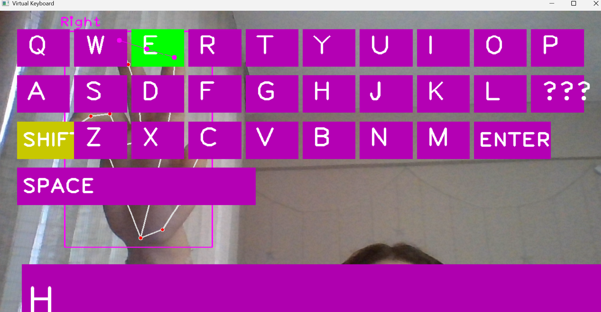
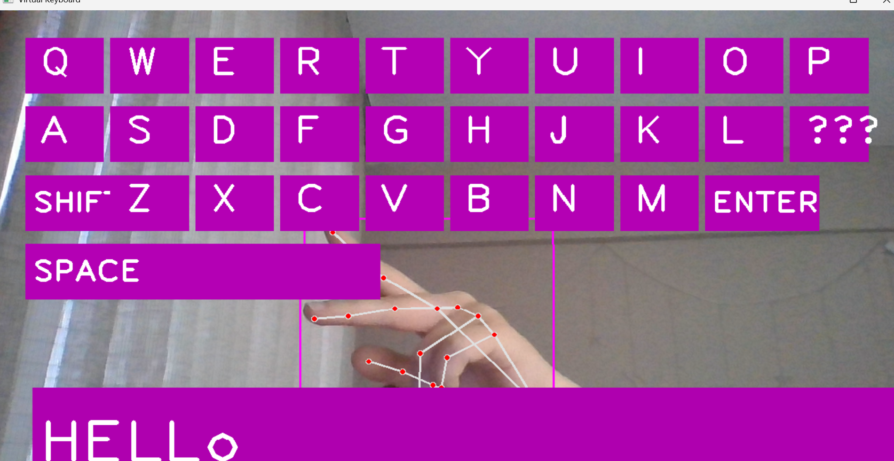
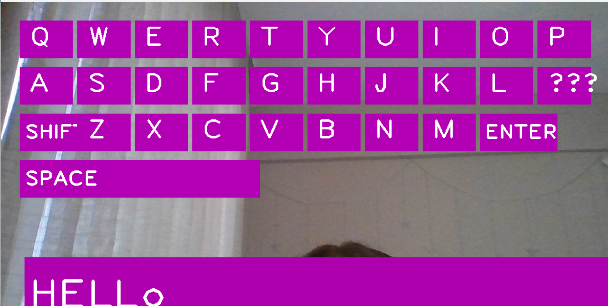

# 🖐️ Virtual Hand Tracking Keyboard

This is a **virtual keyboard** project built using **Python**, **OpenCV**, and **MediaPipe**, which allows users to type using their fingers in front of a webcam. The system detects your hand and simulates keyboard input based on which virtual key your finger is hovering over and tapping.

---

## 📷 Demo
Shift open


Shift close


Final


---

## ✨ Features

- 🔤 Full QWERTY keyboard layout
- 🖐️ Real-time hand tracking using MediaPipe
- 🔡 Shift toggle for uppercase/lowercase characters
- ⌫ Backspace support
- ↵ Enter support (multi-line input)
- ⌨️ Blinking cursor animation
- ⛔️ Spam/tap filtering for clean inputs
- 🎨 Visual feedback when pressing a key
- ✅ Custom colors, clean design

---

## 🧰 Technologies Used

- [Python 3.10+](https://www.python.org/)
- [OpenCV](https://opencv.org/)
- [MediaPipe](https://google.github.io/mediapipe/)
- [cvzone](https://github.com/cvzone/cvzone) (for simplified hand tracking)
- `time`, `numpy`

---

## 🚀 Installation

1. **Clone the repository**

    ```bash
    git clone https://github.com/your-username/virtual-keyboard.git
    cd virtual-keyboard
    ```

2. **(Optional) Create and activate a virtual environment**

    ```bash
    python -m venv venv
    venv\Scripts\activate  # On Windows
    ```

3. **Install dependencies**

    ```bash
    pip install -r requirements.txt
    ```

4. **Run the app**

    ```bash
    python main.py
    ```

---

## ⌨️ Controls

| Key     | Description                    |
|---------|--------------------------------|
| A–Z     | Type characters                |
| ⌫       | Backspace (delete character)   |
| ENTER   | New line                       |
| SHIFT   | Toggle uppercase/lowercase     |
| SPACE   | Insert space                   |
| `q`     | Quit the application           |

---
